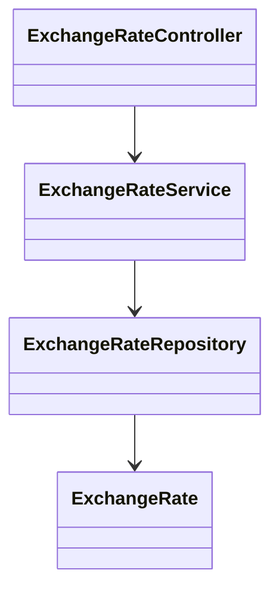
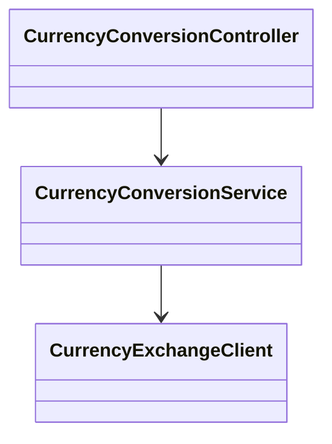

# Class Diagrams

## Exchange Service

```mermaid
classDiagram
  class ExchangeRateController
  class ExchangeRateService
  class ExchangeRateRepository
  class ExchangeRate

  ExchangeRateController --> ExchangeRateService
  ExchangeRateService --> ExchangeRateRepository
  ExchangeRateRepository --> ExchangeRate
```

## Conversion Service

```mermaid
classDiagram
  class CurrencyConversionController
  class CurrencyConversionService
  class CurrencyExchangeClient

  CurrencyConversionController --> CurrencyConversionService
  CurrencyConversionService --> CurrencyExchangeClient
```
