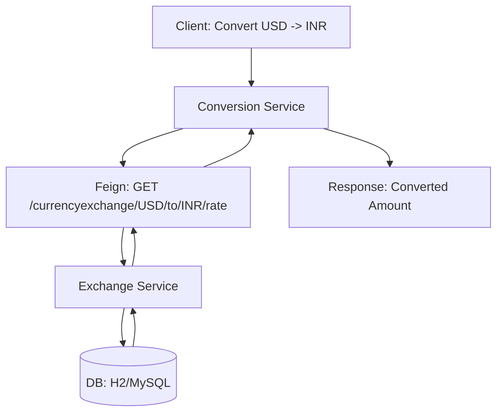

# High Level Design (HLD)

## Responsibility Split

- Currency Exchange Service: owns exchange-rate data, exposes rate lookup/management APIs, persists to H2/MySQL.
- Currency Conversion Service: orchestrates conversion, calls Exchange via OpenFeign, applies resilience policies.

## Request Flow

## Resilience

- Retry (transient failures)
- Circuit Breaker (downstream protection)
- Bulkhead (isolation)
- Rate Limiter (back-pressure)

## Observability

- Actuator health/metrics
- Micrometer → Prometheus
- Structured JSON logging

## Deployment Targets

- Local JVM
- Docker images via Spring Boot Buildpacks
- Kubernetes (Deployments + Services)
