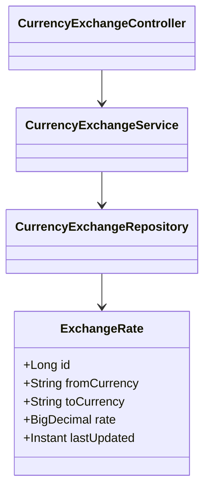

# Low Level Design (LLD)

## Components per Service

- Controller → handles HTTP endpoints
- Service → business logic
- Client (Feign) → inter-service calls
- Repository (Exchange svc) → persistence
- Entities/DTOs

## Configuration

- OpenFeign clients with per-client configs
- Resilience4j policies (retry, circuitBreaker, bulkhead, rateLimiter)
- Actuator endpoints for health and metrics
