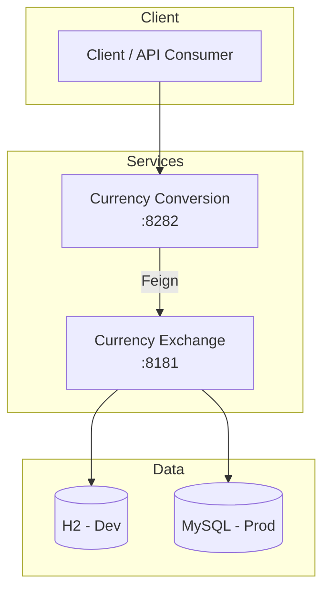

# System Architecture Overview

The Currency Service is built as two Spring Boot microservices that collaborate over HTTP:

- Currency Exchange Service (port 8181) manages exchange rates and persistence
- Currency Conversion Service (port 8282) calculates converted amounts using the exchange rates

Key qualities: scalability (horizontal), resilience (Retry, CircuitBreaker), observability (Actuator, Micrometer), and portability (Docker/Kubernetes).
