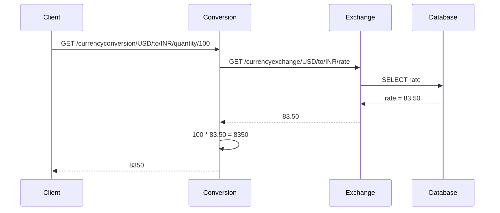
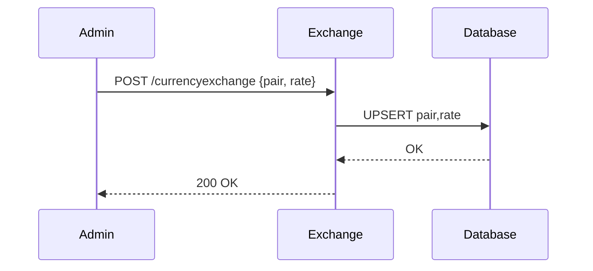

# Sequence Diagrams

## Conversion Flow

```mermaid
sequenceDiagram
  participant Client
  participant Conv as Conversion
  participant Ex as Exchange
  participant DB as Database

  Client->>Conv: GET /currencyconversion/USD/to/INR/quantity/100
  Conv->>Ex: GET /currencyexchange/USD/to/INR/rate
  Ex->>DB: SELECT rate
  DB-->>Ex: rate = 83.50
  Ex-->>Conv: 83.50
  Conv->>Conv: 100 * 83.50 = 8350
  Conv-->>Client: 8350
```

## Exchange Rate Update

```mermaid
sequenceDiagram
  participant Admin
  participant Ex as Exchange
  participant DB as Database

  Admin->>Ex: POST /currencyexchange {pair, rate}
  Ex->>DB: UPSERT pair,rate
  DB-->>Ex: OK
  Ex-->>Admin: 200 OK
```
