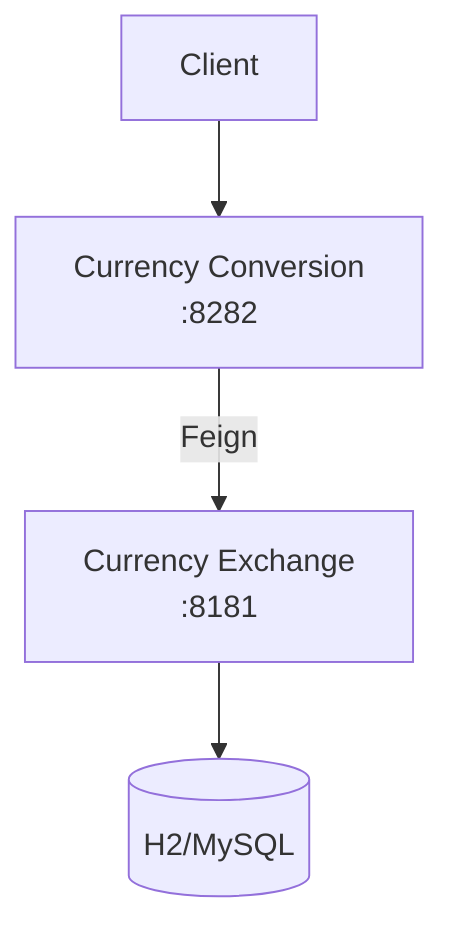

# Currency Service

Two microservices:

- Currency Exchange Service: provides exchange rates (8181)
- Currency Conversion Service: converts amounts using exchange rates (8282)

Open the Architecture section to explore more details.
